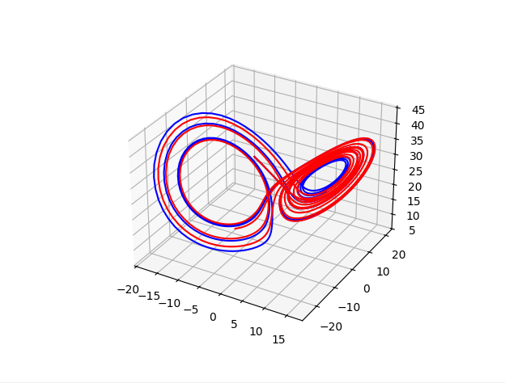
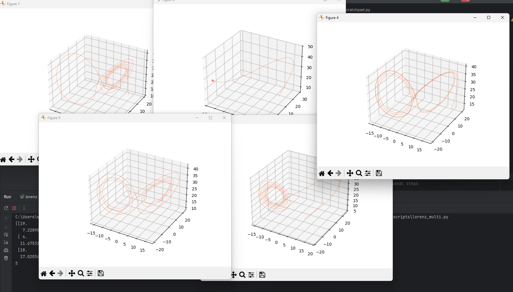

## Introduction - how to clone repo and run

1. Open command line
2. cd "path/to/your/folder"
3. git clone https://github.com/william-lizr/lorentz_attractor-test.git
4. Open command line again:
5. pip install requirements
6. Open file of choice and run python script
7. tweak parameters of your choice - step size, total duration of simulation
   (the longer the simulation - i.e. T=>50), the more all visualizations will look similar because they will cover the entire parameters space.

## Files:
#### lorenz attractor.py  
--> single lorenz attractor code

#### lorenz_multi.py  
--> simulate arbitrary number of lorenz attractors

#### scratchpad.py  
--> to verify how lines of code will work  
mostly to check dimensions of lists

## Output:
### lorenz attractor.py  
blue => RK4 integration from this code  
red => using the python integrator from:   
"from scipy.integrate import solve_ivp" (line 3)  

### lorenz_multi.py
WARNING: opens multiple windows which you will have to close manually

